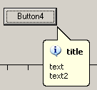

# TBalloonControl

The TBalloon component provides an easy interface to balloon-shaped tooltips which appear more and more in modern software. You can choose to attach a balloon-window to a control, but you can also place it anywhere on your desktop, just define the coordinates of the point in pixels.

The following picture shows how a balloon window could look when attached to a form control. You can also place it anywhere on the screen you want, just supply the coordinates in pixels.



To achieve this, the following fragment of Delphi-code could be used:

```delphi
procedure TForm1.Button4Click(Sender: TObject);
begin
  BalloonControl1.ShowControlBalloon;
end;
```

All properties are accessible through the Object Inspector, so no complicated code is needed. Just set the title, control & text properties, and call the ShowControlBalloon once to show a balloon next to a control.
